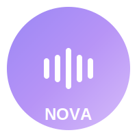

<div align="center">



# Nova -- AI Voice Assistant


</div>

---

##  Overview

Nova is a production-grade, multilingual AI voice assistant that delivers natural conversation directly in the browser. Powered by Google Gemini 2.0 Flash with real-time SSE streaming, a 3D GLSL shader visualization, and full Web Speech API integration, Nova supports English, Arabic (Lebanese), and French. Talk, type, or say "Hey Nova" -- it handles all three.

---

##  Features

###  Voice & Speech

-  **Speech Recognition** -- Browser-native speech-to-text via Web Speech API with interim results
-  **Text-to-Speech** -- Sentence-queue TTS with per-language pitch/rate tuning and intelligent voice selection
-  **Wake Word Detection** -- Hands-free activation with "Hey Nova" / "Nova"; extracts trailing query automatically
-  **Chrome 15s TTS Fix** -- Prevents Chrome from silently cutting off long utterances via sentence splitting and periodic pause/resume keep-alive
-  **Multilingual Support** -- English (US), Arabic (Lebanese), French with voice-triggered language switching
-  **Listening Debounce** -- 250ms stop-restart delay prevents overlapping recognition sessions

###  AI Backend

-  **SSE Streaming** -- Real-time progressive text delivery via Netlify Edge Functions (Deno runtime)
-  **Server-side API Proxy** -- Gemini API key never reaches the browser; proxied through Netlify serverless functions
-  **Multi-turn Context** -- Last 10 conversation messages sent with each request for context-aware responses
-  **Rate Limiting** -- 30 requests per 60-second window per IP with in-memory tracking
-  **Retry with Backoff** -- Automatic retry on 503 errors (2 attempts, 1s base delay)
-  **Safety Filtering** -- 4 harm categories blocked at medium threshold (harassment, hate, sexual, dangerous content)
-  **Tuned Generation** -- temperature 0.7, topK 40, topP 0.95, maxOutputTokens 1024
-  **Streaming Fallback** -- Automatically falls back to single-shot requests when streaming fails

###  User Experience

-  **Text Input** -- Type-to-chat alternative with localized placeholders and RTL support for Arabic
-  **Message Search & Filtering** -- Real-time case-insensitive search with highlighted matching text and result count
-  **Conversation Persistence** -- Messages survive page refresh via localStorage (capped at 200 messages with schema validation)
-  **Time-based Greeting** -- Contextual welcome message based on time of day (morning / afternoon / evening)
-  **Fully Responsive** -- Adapts layout and blob sizing for mobile and desktop
-  **Accessible Conversation History** -- Focus trap, keyboard navigation, focus restoration, outside-click dismiss
-  **Language Selector** -- Visual picker with flag indicators; spoken confirmation on switch

###  Network Awareness

-  **Online/Offline Detection** -- Reactive connectivity status with localized banner (EN/AR/FR)
-  **Network Quality Monitoring** -- Reads effective connection type, downlink, RTT, and Save-Data via Network Information API
-  **Adaptive Streaming** -- Automatically disables SSE on 2G / slow-2G / Save-Data connections
-  **Slow Network Banner** -- Visual warning when degraded connection is detected

###  3D Blob Visualization

-  **Three.js Animated Blob** -- IcosahedronGeometry at detail level 5 (~20K faces) with custom GLSL shaders
-  **Simplex Noise Deformation** -- Organic surface morphing via 3D simplex noise in vertex shader
-  **Fresnel Rim Lighting** -- Glowing edge effect with pulse color oscillation in fragment shader
-  **State-driven Colors** -- Idle (purple), Listening (blue), Speaking (purple), Responding (green)
-  **WebGL Context Recovery** -- Handles GPU context loss/restore without reloading
-  **Keyboard & Screen Reader Support** -- Enter/Space activation, dynamic aria-labels per state

###  Security

-  **Content Security Policy** -- Strict CSP with whitelisted sources; frame-ancestors and object-src set to none
-  **HSTS** -- Forced HTTPS with 2-year max-age, includeSubDomains, and preload
-  **Security Headers** -- X-Frame-Options (DENY), X-Content-Type-Options (nosniff), Referrer-Policy (strict-origin-when-cross-origin)
-  **Permissions Policy** -- Microphone restricted to self; camera blocked entirely
-  **Input Validation** -- Query length (2000 chars), history cap (10 items), language enum enforcement

###  Additional Features

-  **Dynamic Favicon** -- Favicon changes to match assistant state (idle / listening / speaking / responding)
-  **Progressive Web App** -- Installable with offline caching via Workbox service worker
-  **Privacy-friendly Analytics** -- Plausible integration (production-only) with custom event tracking
-  **Error Tracking** -- Global error capture with FIFO buffer (max 20 reports); unhandled rejection handling
-  **Localized Error Messages** -- Error text displayed in the user's active language

---

##  Getting Started

1. **Clone the Repository**

   ```bash
   git clone https://github.com/naveed-gung/nova.git
   cd nova
   ```

2. **Install Dependencies**

   ```bash
   npm install
   ```

3. **Set Up Environment Variables**

   For **local development**, create a `.env` file:

   ```env
   VITE_GEMINI_API_KEY=your_gemini_api_key
   ```

   For **Netlify deployment**, set `GEMINI_API_KEY` in the Netlify dashboard (Settings > Environment variables). The API key is proxied through a serverless function and never exposed to the client.

4. **Start Development Server**

   ```bash
   npm run dev
   ```

   The app will be available at `http://localhost:8080`.

---

##  Voice Commands

### Wake Word

Say **"Hey Nova"** or **"Nova"** followed by your question to activate hands-free. The assistant will detect the wake word and process the trailing query automatically.

### Language Switching

| Language    | Commands                                                               |
| ----------- | ---------------------------------------------------------------------- |
| **English** | "Switch to Arabic", "Speak Arabic", "Switch to French", "Speak French" |
| **Arabic**  | "تكلم انجليزي" (Speak English), "تكلم فرنسي" (Speak French)            |
| **French**  | "Parle anglais", "Passer a l'anglais", "Parle arabe"                   |

---

##  Tech Stack

| Layer                                                                               | Technology                                                       |
| ----------------------------------------------------------------------------------- | ---------------------------------------------------------------- |
|  Frontend | React 18.3.1 + TypeScript 5.5.3                                  |
|  Styling   | Tailwind CSS 3.4.11 + tailwindcss-animate                        |
|  AI               | Google Gemini 2.0 Flash (via Netlify Functions + Edge Functions) |
|  Speech       | Web Speech API (SpeechRecognition + SpeechSynthesis)             |
|  3D             | Three.js 0.159.0 (custom GLSL shaders)                           |
|  Build     | Vite 7.3.1 + SWC                                                 |
|  PWA            | vite-plugin-pwa 1.2.0 + Workbox                                  |
|  Backend    | Netlify Functions (Node.js) + Edge Functions (Deno)              |

---

##  Architecture

###  Dynamic Blob Visualization

- GLSL simplex noise vertex shader drives organic surface deformation
- Fresnel rim lighting with pulse color oscillation in fragment shader
- State-driven color and animation parameters (speed, amplitude, pulse rate)
- WebGL context recovery for resilience against GPU context loss
- Code-split Three.js chunk (~452KB) loaded independently

###  AI Pipeline

- **Streaming path**: Client → Netlify Edge Function (Deno) → Gemini SSE endpoint → chunked text back to UI
- **Non-streaming path**: Client → Netlify Handler Function (Node.js) → Gemini REST endpoint → complete response
- Automatic path selection based on network quality; manual fallback on stream failure
- Per-language system prompts instruct concise, direct responses

###  Security Model

- API key isolated on server; never bundled or transmitted to the client
- CSP, HSTS, X-Frame-Options, and Permissions-Policy headers enforced via `netlify.toml`
- Rate limiting at the function layer (30 req/min per IP)
- Input validation on query length, history depth, and language enum

###  Deployment

- Hosted on Netlify with automatic builds from the repository
- PWA with Workbox service worker for offline asset caching
- Code-split bundles for optimal loading performance
- SPA fallback routing configured for client-side navigation

---

<div align="center">

[Live Demo](https://n0v0.netlify.app/)

</div>
